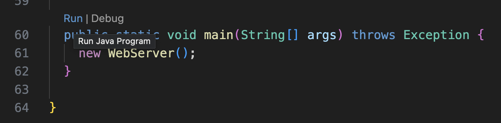
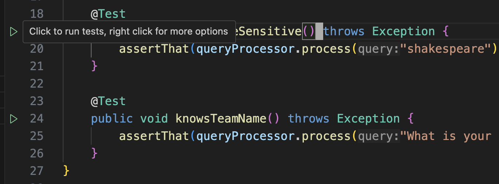
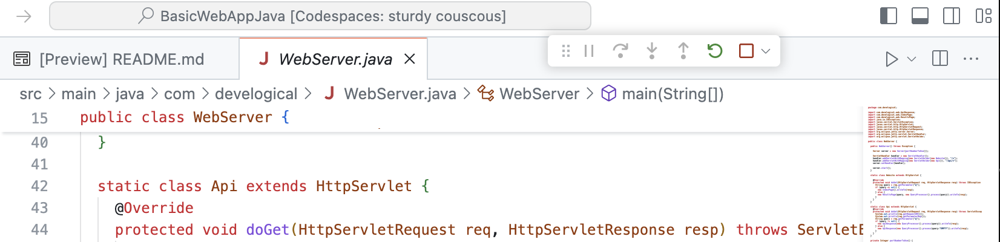
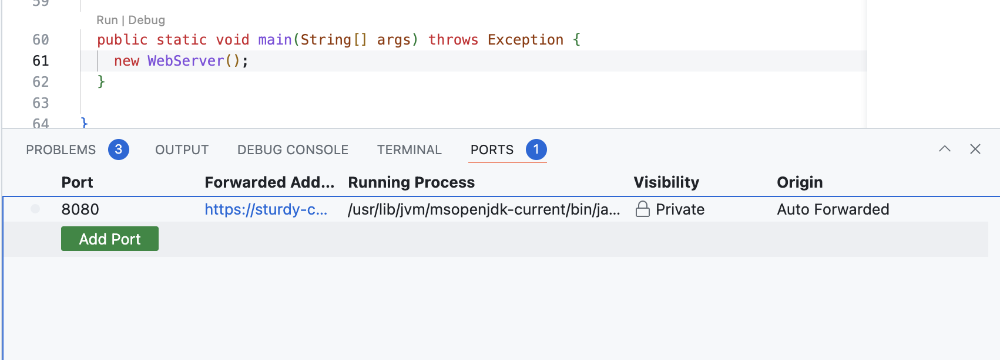
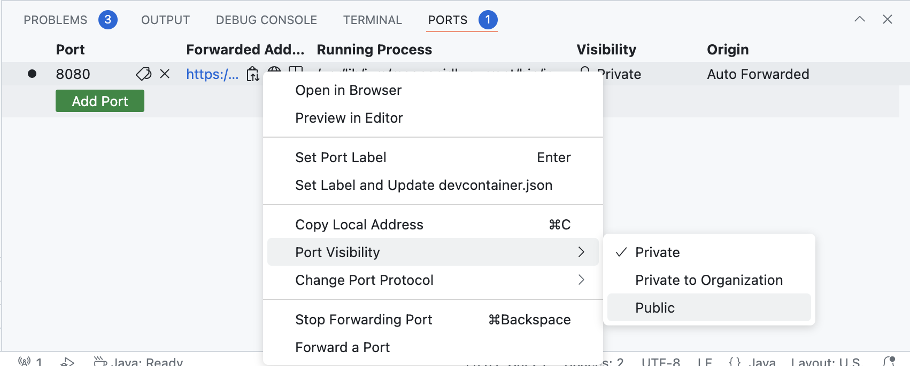
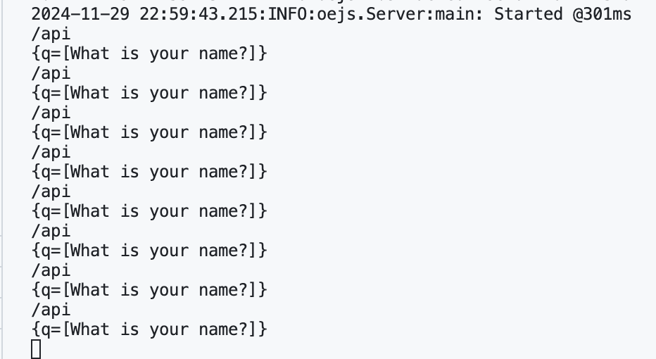

# Extreme Startup

In today's lecture, we will be engaging in an interactive programming exercise, set up as a game.

The idea of the exercise is that you are part of an extreme startup that is rapidly iterating to meet customer demand.
This exercise will be performed in teams.

Your team will set up a small web app and log into a game website.  The game server will send requests to your web app, and your web app will (hopefully) respond to them.  The game server will then check the answer your web app sends, and score your team.  There will be a leaderboard where you can check your progress.  The game will proceed in rounds, where the requests sent will become more complicated over time.

The point of the exercise isn't to develop a perfect web application in response to the game server, but to engage in rapid/continuous iteration and deployment, and reflect on the challenges.

We have set up this repository with a simple Java web server as a starting point, that you can deploy within Codespaces.

## The Starter Codebase: Basic Web App (Java)

This code is forked from https://github.com/rchatley/BasicWebApp.
It contains a simple Java web server that listens on port 8080 and exposes a single `/api` HTTP endpoint.
Queries received on the `/api` endpoint are handed to `QueryProcessor.process(String)`.

### Local Setup (via Dev Container or Codespace)

To run the code locally on your machine, you should use the provided development container.
To use it, you should use CMD (or CTRL) + SHIFT + P to bring up a dropdown menu; from there, you should type or select "Dev Containers: Rebuild Container" to build the development container and drop you in it.

**To run the web app from within VS code,** you can click the "Run" or "Debug" annotation above the `public static void main` in `WebServer.Java`. Clicking the latter will enable the debugger.



**To run the tests from within VS Code,** you can click the green arrow in the gutter next to the test, as shown below.



**To build and run the web app via the command line,** you will need to execute the following commands within the terminal:

```
mvn clean package
java -jar target/BasicWebApp-1.0-SNAPSHOT.jar
```

**To run the tests via the command line,** you will need to execute the followng command from within the terminal:

```
mvn test
```

## Deployment (via Codespaces)

**As a team, you need at least one person to have launched a Codespace for the project.**
One person from your team will be responsible for hosting your team's web app from within their Codespace instance.
To do so, that team member will first need to launch the web app using either the IDE or CLI as described above.
Note that you may need to hit the "Play" button in the top right corner the first time that you deploy from codespaces, as shown below.



Upon launching the web app, VS Code will automatically forward port 8080 to a web address that you can access from your browser.



By default, this URL is private and can only be accessed by you.
**You must make it public to participate in the competition.**
To do so, you can right click on the entry in the Ports table and set the port visibility to Public as shown below.



After doing so, you should ask a different member to access the web app from the provided URL.
You may need to select "Continue" the first time that you visit a web app served from a Codespace instance.

## Enter the competition

Navigate to https://extreme-startup.fly.dev

Enter a name for your team, and the game code shared in class.

Enter the URL for your public web app, with /api appended to the end.

**It is very important you include the /api at the end or the game server will not send requests to the correct endpoint.**

The game server will periodically send queries to the endpoint.
If it's working, your app (however it's running) will log output indicating the received query.



If you enter the incorrect URL, you can just join the game anew with a new URL.
If this happens, let an instructor know and we will delete the previous entry.

### Warmup

In the warmup round, the game server will only send the query "What is your name?".
The correct answer for your web app is your team name, so you will be giving the "incorrect" response at first.

In warmup, try to get your app to respond correctly.

## Playing subsequent game rounds

When the teams have things set up correctly, we'll move on to real rounds. The queries will become more complicated.

Your goal as a team is to modify your app to respond to the queries correctly.

At this point, your team can work however you like!  If multiple teammates are able to work from their computers, multiple people can code simultaneously.

You can add code, tests, or configuration.
We also have access to GitHub Actions minutes that you can use.

We will warn you before we advance game rounds.
